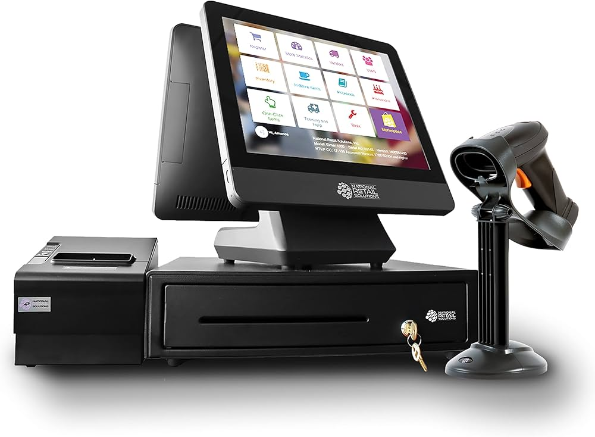
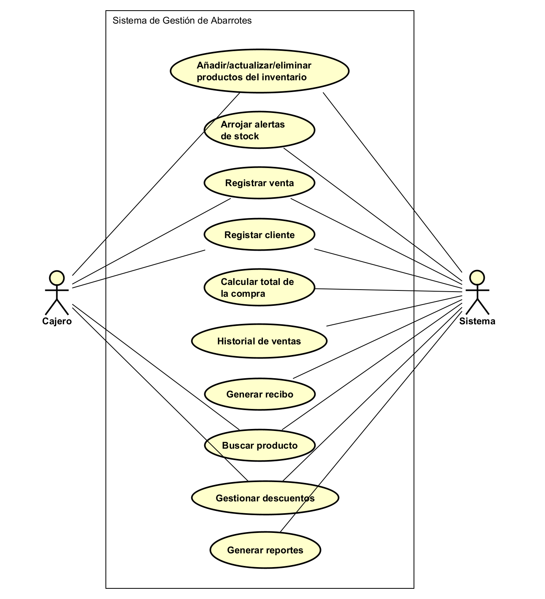
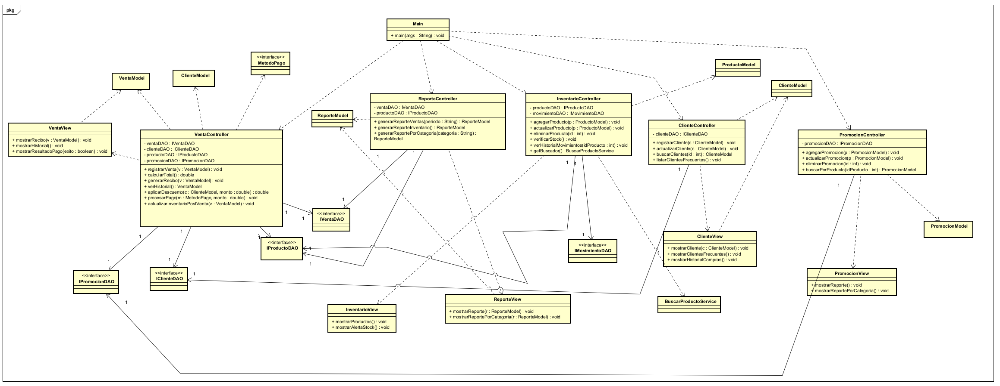
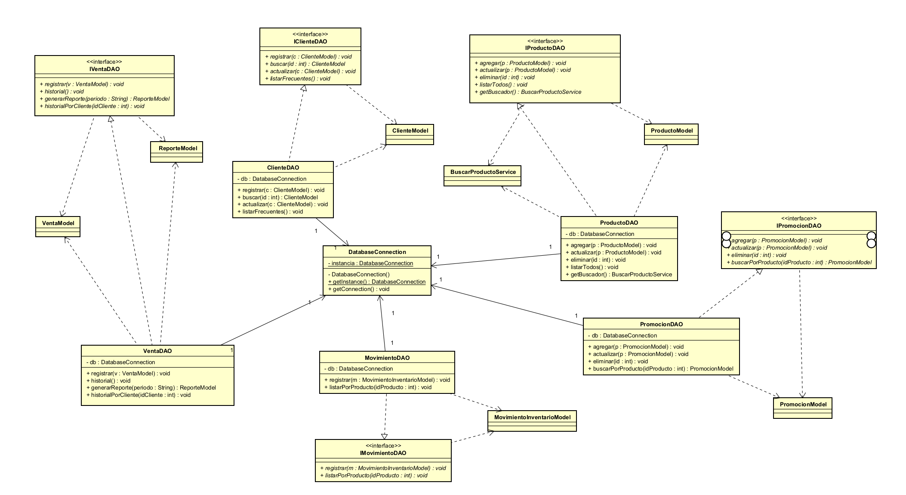
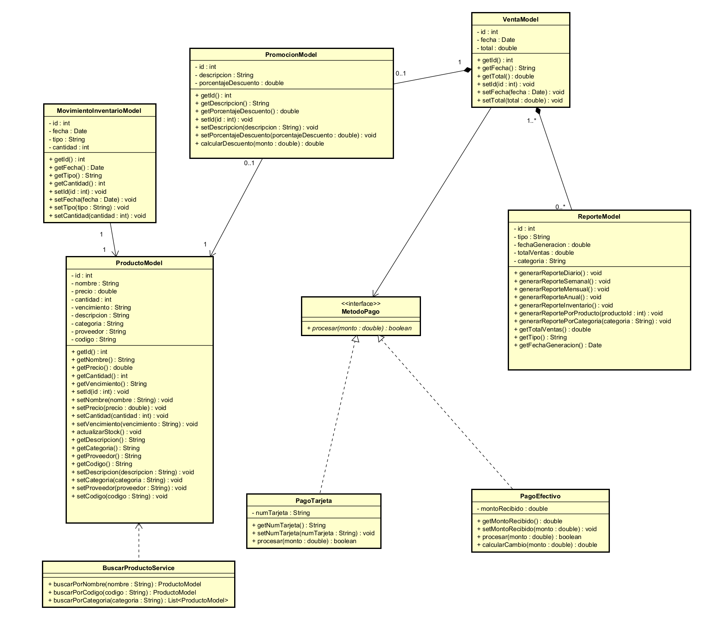
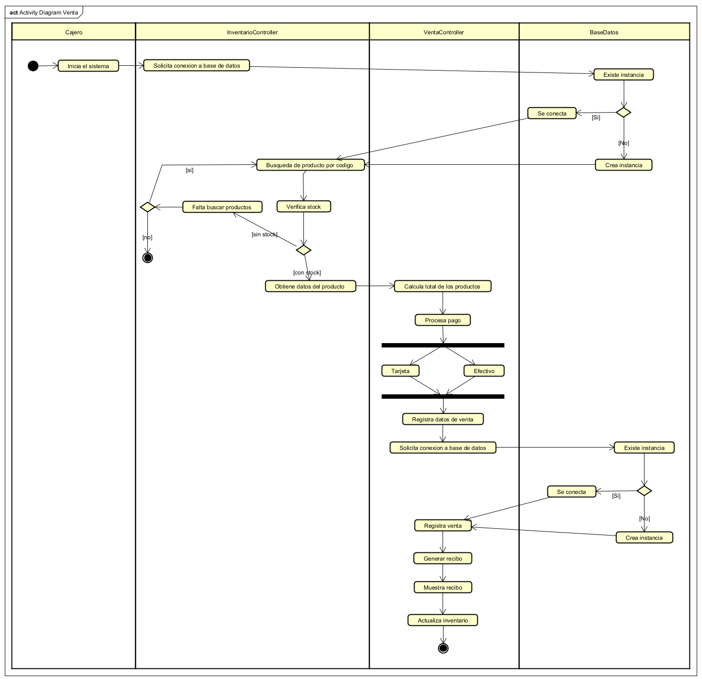

# SistemaGestionAbarrotes 🧾

Es una aplicación de software que permite a una tienda de abarrotes gestionar sus operaciones de manera efectiva. Brinda una solución completa para las actividades diarias de la tienda, mejorando la eficiencia, la precisión y la toma de decisiones comerciales.

## Requisitos funcionales 📌

### Gestión de inventario 📦

| Num | Requisito |
|---|---|
| RF1.1 | El sistema debe permitir registrar nuevos productos en el inventario, incluyendo nombre, código, descripción, precio, cantidad, fecha de vencimiento y proveedor. |
| RF1.2 | El sistema debe permitir actualizar las existencias de los productos disponibles. |
| RF1.3 | El sistema debe permitir eliminar productos obsoletos, dañados o vencidos. |
| RF1.4 | El sistema debe generar alertas automáticas cuando el nivel de inventario de un producto alcance un umbral predefinido. |
| RF1.5 | El sistema debe permitir consultar el historial de movimientos del inventario. |

### Registro de ventas 🛒

| Num | Requisito |
|---|---|
| RF2.1 | El sistema debe permitir registrar ventas de productos. |
| RF2.2 | El sistema debe calcular automáticamente el total de la compra con base en los productos seleccionados. |
| RF2.3 | El sistema debe asociar cada venta a un cliente registrado o permitir ventas sin registro de cliente. |
| RF2.4 | El sistema debe almacenar un historial de todas las ventas realizadas, incluyendo fecha, productos vendidos y monto total. |
| RF2.5 | El sistema debe generar un comprobante o recibo por venta realizada. |
| RF2.6 | El sistema debe actualizar automaticamente el inventario despues de cada venta. |

### Búsqueda y Consulta de Productos 🔍

| Num | Requisito |
|---|---|
| RF3.1 | El sistema debe permitir buscar productos por nombre, código o categoría. |
| RF3.2 | El sistema debe mostrar información detallada de cada producto, incluyendo precio, cantidad disponible y fecha de vencimiento. |

### Gestión de Clientes 👤

| Num | Requisito |
|---|---|
| RF4.1 | El sistema debe permitir registrar nuevos clientes. |
| RF4.2 | El sistema debe permitir gestionar la información de los clientes, incluyendo nombre, dirección y número telefónico. |
| RF4.3 | El sistema debe permitir consultar el historial de compras de cada cliente. |
| RF4.4 | El sistema debe permitir asignar descuentos o beneficios a clientes registrados. |
| RF4.5 | El sistema debe permitir identificar clientes frecuentes. |

### Gestión de Promociones y Descuentos 🏷️

| Num | Requisito |
|---|---|
| RF5.1 | El sistema debe permitir configurar promociones y descuentos en productos específicos. |
| RF5.2 | El sistema debe aplicar automáticamente los descuentos correspondientes durante el proceso de venta. |

### Gestión de Reportes 📊

| Num | Requisito |
|---|---|
| RF6.1 | El sistema debe generar reportes de ventas en diferentes periodos (diario, semanal, mensual y anual). |
| RF6.2 | El sistema debe generar reportes del estado actual del inventario. |
| RF6.3 | El sistema debe generar reportes de análisis de ventas por producto y por categoría. |

## Requisitos no funcionales 📌

| Num | Requisito |
|---|---|
| RNF1 | El sistema debe contar con una interfaz gráfica intuitiva, amigable y fácil de usar. |
| RNF2 | El sistema debe ser accesible para usuarios con conocimientos básicos de informática. |
| RNF3 | El sistema debe responder a consultas y operaciones en un tiempo menor a 2 segundos bajo condiciones normales de uso. |
| RNF4 | El sistema debe estar estructurado de manera modular para facilitar su mantenimiento y futuras mejoras. |

## Diagramas UML 📌

### Diagrama de Casos de Uso

### Diagrama de Clases

### Diagrama de Clases (Base de Datos)

### Diagrama de Clases de Venta

### Diagrama de Actividad

### Diagrama de Secuencia
Se encuentra dentro del proyecto asta

## Recursos 📌

Aquí se pueden encontrar todos los documentos del proyecto

- [Imágenes de diagramas](docs/uml/imagenes)
- [Proyecto asta](docs/uml/astah)